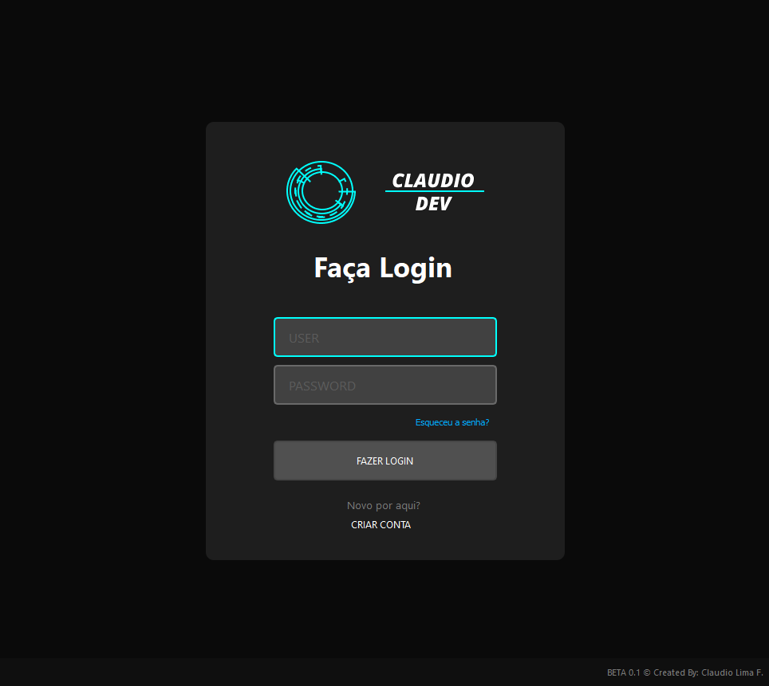
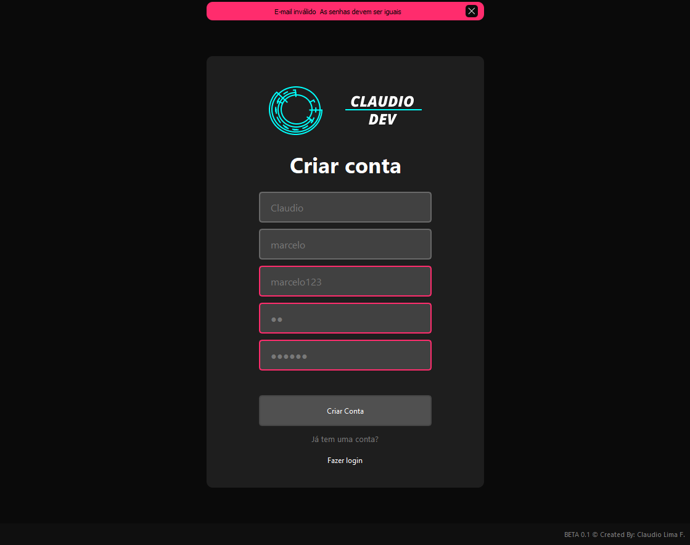

# Bem vindo ao **LOGIN Dev**!
<p></p>

O desenvolvimento de interfaces gráficas é algo muito importante em toda a produção de um projeto.
Neste projeto eu dou inicio a construção de uma interface de login e criação de contas, tudo foi construido utilizando o PyQt5 sem intuitos de lucro.   
_**A intenção inicial não é criar uma interface de produção, logo não está conectada a nenhum banco de dados, por enquanto!**_

## Redes Sociais
* [Instagram](https://www.instagram.com/claudiogfez/)
* [Linkedin](https://www.linkedin.com/in/clcostaf/)

## Imagens do projeto
### Tela de Login
 
### Tela de Criar Conta
 
### Tela de Esqueceu a senha
 
### Verificação dos campos
 
 
 
### Campos preenchidos corretamente
 
 
 
## Instalação

1. Primeiramente você pode clonar este repositório.

```
$ git clone https://github.com/clcosta/Login_dev.git
```

2. Agora a instalação das bibliotecas

```
pip install -r requirements.txt
```

## Como utilizar

* Com tudo já instalado é só executar o código!

```
python app.py
```

# Autor
| [<br><sub>@clcostaf</sub>](https://github.com/clcosta) |
| :---: |
